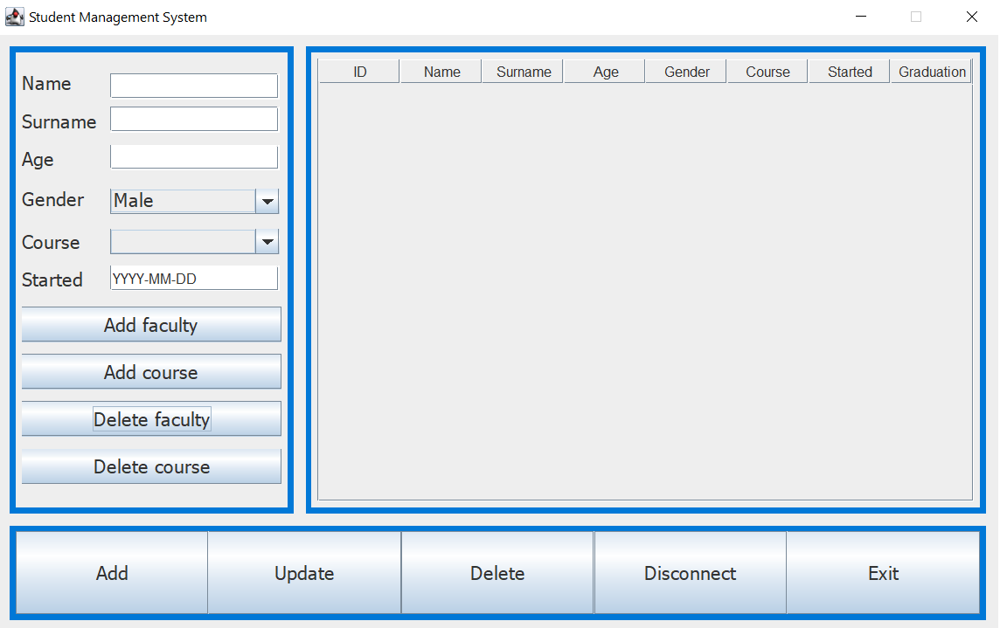

<h1 align="center"><strong><em>Student Management System</strong></em></h1>

  
# How to run the app?

To run this application: 
 

* You have to have Java installed. You can download it here: <a href="https://www.java.com/en/">Link</a>
* After that accees the <a href="https://github.com/Yashmerino/S-M-S/releases">Releases</a> section and download the last version of the application.
* Right-click the zipped folder saved to your computer and choose "Extract All". Run the application and enjoy!

<h1 align="center"><strong>Demonstration</strong></h1>

# Student Management System has 3 languages!

In order to change the language, click this button and select out of 3 languages your preferred language(English will be set by default): 

<h2 align="center">Russian</h2>

<h2 align="center">Romanian</h2>

# How to connect to my database?

To connect to the desired database, you have to type your database url, login and password(if you don't have one, just leave the field blank) 

If the connection was successfully established, this window will show up where you can start adding faculties/courses/students! 

